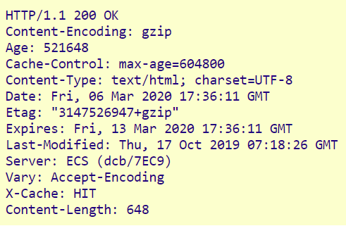
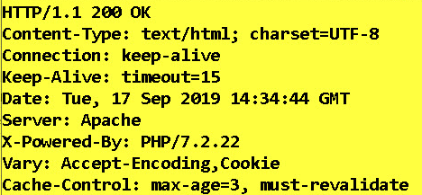

# Enabling strict types

```php

declare(strict_types=1);

```

# variables

```php

$greeting = 'Hello'; // string
$quantity = 5; // int
$price = 5.20; // float
$is_child = true; // boolean
$name; // null

```

# Echo command

Is used to print to out to the browser

```php

<?php echo $name; ?>

```

## Echo Shorthand

Use when you want to write only a single value to the browser

```php

<?= $member[0]?>

```

# Scalar (Basic) data types

## String

```php

$name = 'Audience';

```

## Numeric

```php

$price = 5;

```

## Boolean

```php

$logged_in = true;

```

## Null

Null data type can only have the value null
It Indicates that a variable value has not been set

## Updating variable values

```php

$name = 'Audience';
$name = 'Ivy'; // the value of name was Audience now it's Ivy

```

# Arrays

## Types of php arrays

1. Indexed arrays
2. Associative arrays
3. Multidimensional arrays

## Indexed arrays

Indexes start at zero and the mark the position of the array values

### Creating an Indexed array

1. ```php
   $shopping_list = ['bread', 'cheese', 'milk'];

   ```

2. ```php
   $shopping_list = array('bread', 'cheese', 'milk')
   ```

### Accessing values in Indexed arrays

```php

echo $shopping_list[0];

```

### Updating values in Indexed arrays

```php

$shopping_list[1] = 'butter';

```

## Associative arrays

Associative arrays have a key value pair

### Creating an Associative array

```php

$member = [
'name' => 'Audience', // name is the key and Audience is the value
'age' => 36,
'country' => 'Zimbabwe'
];

```

### Accessing values in Associative arrays

```php

echo $member['name'];

```

### Updating values in Associative arrays

```php

$member['name'] = 'Donne';

```

## Multidimensional arrays

They are comprised of arrays inside of arrays

```php

$members = [
['name' => 'Audience', 'age' => 36 ,  'country' => 'Zimbabwe',],
['name' => 'Emi',      'age' => 24,   'country' =>    'Japan',],
['name' => 'Luke',     'age' => 47 ,  'country' =>      'USA',],
]

```

### Accessing values in Multidimensional arrays

```php

echo $members[0]['name'];

```

### Updating values in Multidimensional arrays

```php

$members[0]['name'] = 'Tom';

```

# Expressions

Expressions consist of one or more constructs that evaluate to a single value

```php

3 - 5;
$total = 3 - 5;
$greeting = 'Hi ' . 'Ivy';

```

# Arithmetic operators

Note: Arithemetic operator precendence applies
to evaluations that

| Operator | Quick Description      |
| -------- | ---------------------- |
| +        | Addition               |
| -        | Subtraction            |
| \*       | Multiplication         |
| /        | Division               |
| %        | Modulus                |
| \*\*     | Exponentiation         |
| ++       | Increment              |
| --       | Decrement              |
| +=       | Additition Assignment  |
| -=       | Subtraction Assignment |

# String operators

| Operator | Quick Description        |
| -------- | ------------------------ |
| .        | Concatenation            |
| .=       | Concatenation assignment |

# Comparison operators

| Operator | Quick Description  |
| -------- | ------------------ |
| ==       | Equal              |
| !=       | Not equal          |
| <>       | Not equal          |
| ===      | Identical          |
| !==      | Not identical      |
| <        | Less               |
| >        | Greater            |
| <=       | Less or Equal      |
| >=       | Greater or Equal   |
| <=>      | Spaceship operator |

## The spaceship operator, compares both operands to each other:

    1. results in 1 if left operand is greater
    2. results in -1 if right operand is greater
    3. results in 0 if both operands are equal

# Logical operators

| Operator | Quick Description |
| -------- | ----------------- |
| &&       | AND               |
| \|\|     | OR                |
| !        | NOT               |

# Type juggling

php will try to convert a value from one data type to another to aid in evaluations

# Control Sructures

## if

```php

if ($logged_in === true) {
run this code block;
}

```

## if else

```php

if ($logged_in === true) {
run this code block;
} else {
run this code block;
}

```

## if elseif else

```php

if ($logged_in === true) {
    run this code block;
} elseif ($time > 12) {
run this code block;
} else {
run this code block;
}

```

## Ternary operator

```php

$child = $age < 16 ? true : false;
$message = ($stock > 0) ? 'In Stock' : 'Sold out';

```

## switch statement

```php

$option = 'option_1';
switch ($option) {
case 'option_1':
run this code block;
break;
case 'option_2':
run this code block;
break;
default:
default code block;
}

```

## match statement

```php

$result = match($option) {
'option_2' => code to run,
'option_3', 'option_4' => code to run,
'option_5' => code to run,
'default'
};

```

### example of match

```php

$day = 'Monday';

$offer = match($day) {
'Monday' => '20% off chocolates',
'Saturday', 'Sunday' => '20% off mints',i
default => '10% off your order',
}

```

# Loops

## while loop

```php

while($counter < 10){
echo $counter;
$counter++;
}

```

## do while loop

Will run at least once before checking the condition

```php

do {
echo $counter;
$counter++;
} while ($counter < 10);

```

## for loop

```php

for ($i = 0; $i < 10; $++){
echo $i;
}

```

## foreach loop

Is designed to work with compound data types like arrays

```php

$products = [
    'mints' => 5.00,
    'toffee' => 4.00,
    'buttercup' => 6.20,
];

foreach($products as $item => $price){
echo $item;
echo $price;
}

```

# Includes

```php

<?php include 'includes/header.php' ?> // adds the code from the file
<?php require 'includes/footer.php' ?> // adds the code from the file
<?php include_once 'includes/footer.php' ?> // make sure the code from the file is included once in any given page
<?php require_once 'includes/footer.php' ?>// make sure the code from the file is included once in any given page

```

# Functions

### How to write a function:

    1.Describe the task and the data it works with

    2.What data is needed to perform the task
    each piece will become a parameter

    3.What instructions must if follow to perfom the task

    4.What is the result you expect
    this will be your return value

    It is good practice for a function to have a return value

    When naming a function think of the data that it returns

### Document your function

    1.what is the function supposed to do

    2.The name of the function

    3.The parameters that it requires

    4.What is should return

## Defining a function

```php


function write_copyright_notice() {
$year = date('Y');
$ message = '&copy; ' . $year;
return $message;
}

```

## Calling the function in a webpage

```php

<?= write_copyright_notice() ?>

```

## Storing the return value in a variable

```php

$copyright_notice = create_copyright_notice();

```

## Defining functions that have parameters

```php

function calculate_cost($price, $quantity) {
return $price * $quantity;
}

```

## Calling functions that have parameters

```php

$total = calculate_cost(3, 5);

$cost  = 4;
$units = 6;
$total = calculate_cost($cost, $units);

```

## Variable scope (Global and Local)

### Accessing a global variable from within a function

```php

$tax_rate = 0.2;

function calculate*running_total($price, $quantity){
global $tax_rate; // this variable is in the global scope
static $running_total = 0;
$total = $price * $quantity;
$tax   = $total _ $tax_rate;
$running_total = $running_total + $total + $tax;
return $running_total;
}

```

Static variable values will be remembered after a function has run
and all other locally scoped variable values have been forgotten

## Functions and compound data types

Functions can accept compound data types as arguments and also return compound data types

```php

$us_price = 4;
$rate = [
'uk' => 0.81;
'eu' => 0,93;
'jp' => 113.21;
];

function calculate*prices($usd, $exchange_rates) {
$prices = [
'pound' => $usd * $exchange*rates['uk'],
'euro' => $usd * $exchange_rates['eu'],
'yen' => $usd * $exchange_rates['jp'],
];
return $prices;
}

$global_prices = calculate_prices($us_price, $rates);

```

## Functions with argument types and return type Declarations

```php

funtion calculate_total (int $price, int $quantity): int {
return $price * $quantity;
}

```

### Types used in argument and return type declarations

( string, int, float, bool, array, className and mixed: which mix some or allthese)

## Multiple return Statements

```php

function get_stock_message($stock){
    if ($stock >= 10) {
return 'Good availability';
}
if ($stock > 0 && $stock < 10) {
return 'Low stock';
}
retrun 'Out of stock';
}

```

## Using Default Values

You can make a parameter to a function optional, by specifying a
default value for the function to use when a value is not suplied

```php

function calculate_cost($cost, $quantity, $discount = 0){
$cost = $cost * $quantity;
return $cost - $discount;
}

```

## calling a fucntion with a default value

```php

$cost = calculate_cost(3,5);

```

Since we did not supply a value for the discount parameter the default value will be used

## Using named arguments

When calling functions in php8 you can put parameter names before their arguments, this means
that the arguments do not need to be given in the same order that they appear at function
definition.

```php

function calculate_cost($cost, $quantity, $discount = 0, $tax = 20,): float {
    $cost = $cost * $quantity;
    $tax = $cost *($tax / 100);
return ($cost + $tax) - $discount;
}

```

When calling a function without named arguments, the arguments have to be in order:

```php

calculate_cost(5, 10, 0, 5);

```

or you can use empty quotes or specify the default value if it is not the last value in the parameter list

```php

calculate_cost(5, 10, '', 5);

```

when calling a function with named arguments, the arguments do not need to be in order:

```php

calculate_cost(quantity: 10, cost: 5, tax: 5)

```

# Objects and Classes

Objects group together varibales and functions that represent things in our day to day.
Classes are used as a templates for creating objects in php.
In objects variables are called properties and functions are called methods.
An object is a compound data type because it can store multiple values

## Defining a class

```php

class Account {
public int $number; // public: is a visibility keyword
public string $type;
public float $balance;

    public function deposit(float $amount): float {

    }
    public function withdraw(float $amount): float{

    }

}

```

## Instantiating an account object:

```php

$account = new Account();

```

## accessing object properties

```php

echo $account->balance;

```

## Setting and Updating object properties

```php

$account->number = 201345654;
$account->balance = 100.00;
$account->name = 'Audience';

```

## Defining and calling methods in an object

```php

class Account {
public int $number;
public string $type;
public float $balance;

    public function deposit($amount){
        $this->balance += $amount;
        return $this->balance;
    }

}

```

```php

$this // Is known as a pseudo-variable and indicates that you want to access a property of this specific object

```

## Calling a method

```php

echo $account->deposit(50.00);

```

Echo is only used here, to write the new balance to the page;

## Constructor method

```php

class Account {
public int $number;
public string $type;
public float $balance;

    public function __construct($number, $type, $balance){
        $this->number = $number;
        $this->type = $type;
        $this->balance = $balance;
    }

}

```

The construct() method must start with two underscores.
The statements inside the method are run automatically when the class is used to create an object.
A construct() method can be used to allow you to create an object
and add values to its properties in one line of code.
Do not name your own functions with double underscores.

```php

$account = new Account(201456654, 'Checking', 1000.00);

```

A simpler way of class definition,
allows you to declare the properties of the class inside the parentheses of the \_\_constructor() method.
This is called constructor property promotion.

```php

class Account {
public function \_\_construct(
public int $number,
public string $type,
protected float $balance = 0.00, // this property has an optional value
) {}

    public function deposit() { // setter

    }

    public function withdraw(){ // setter

    }

    public function get_balance(){ // getter
    return $this->balance;
    }

}

```

To prevent code outside of an object from getting or setting values stored inside object properties or calling object methods
you can set their visibility to protected.
Then only a getter or setter method can update property values.

## Storing an array in an object property

```php

class Account {
public array $numbers;
public string $type;
public float $balance;

    public function __construct($numbers, $type, $balance){
        $this->number = $number;
        $this->type = $type;
        $this->balance = $balance;
    }
}

```

## Storing an array in a property of an object

```php

$account->number = ['account_number' => 12345687,
'routing_number' => 98765432,];

```

## Accessing a value stored in an array in the number property

```php

echo $account->numbers['account_number'];

```

## Storing an object in a property of an object

```php

class Account {
    public AccountNumber $number;
    public string $type;
    protected float $balance;

    public function __construct(AccountNumber $number, string $type, float $balance = 0.00)
    {
        $this->number  = $number;
        $this->type    = $type;
        $this->balance = $balance;
    }

    public function deposit(float $amount): float
    {
        $this->balance += $amount;
        return $this->balance;
    }

    public function withdraw(float $amount): float
    {
        $this->balance -= $amount;
        return $this->balance;
    }

    public function getBalance(): float
    {
        return $this->balance;
    }

}

class AccountNumber
{
public int $accountNumber;
public int $routingNumber;

    public function __construct(int $accountNumber,
                                int $routingNumber)
    {
        $this->accountNumber = $accountNumber;
        $this->routingNumber = $routingNumber;
    }

}

```

## Create an object to store in the property

```php
$numbers = new AccountNumber(12345678, 987654321);

```

## Create instance of Account class and set properties

```php

$account = new Account($numbers, 'Savings', 10.00);

```

# HTTP requests and responses

Http: is a set of rules that specify how browsers should request pages
and how servers should format their response.
This helps to understand what data is sent at each step.

## When a browser requests a page

The browser's address bar shows a URL which specifies how it can find
that page. Each URL has:

    1. A protocol (HTTP or HTTPS)

    2. A host (The server to send the request to)

    3. A path that identifies the requested file

    4. An optional query string with additional data that the page
     might need.

### Query string

PROTOCOL{http://} HOST{example.com} PATH{/year.php} SEPERATOR{?} QUERY STRING{year=2023}

When a query string is added to the end of a URL, each piece of data
it sends is like a variable.
It has:

    1. A name that describes the data being sent
        the name is the same each time the URL is used

    2. The value for this piece of data. The value can
        change each time the page is requested.

### Http request headers

HTTP request headers (not shown in the main browser window)
headers hold data that servers may find helpful and are
also similar to a variable, they have:

    1. A name that describes what data is being sent
        the name is the same each time the URL is used

    2. A value for each piece of data



## When a web server receives a requaest for a PHP page

It responds by:

    1. Finding the PHP file requested in the URL

    2. Getting the PHP interpreter to process any PHP code the PHP file contains

    3. Sending an HTML page back to the browser made the request

When the server sends back HTML to the browser it also sends:

### Http response headers

They hold data that the browser might need to know about the file that is returning\
Each response header has a name and value just like a variable.
Response headers tell the browser

    1. The file's media type and encoding system

    2. Date and time the file was sent

    3. Type of web server used to send the file



The sever also sends back two pieces of data to indicate whether the request
was successful or not:

1. A three-digit status code for software to interpret

2. A reason-phrase that people can read

| Status Code | Reason-Phrase         |
| ----------- | --------------------- |
| 200         | OK                    |
| 301         | Moved Permanently     |
| 307         | Temporary redirect    |
| 403         | Forbidden             |
| 404         | Not found             |
| 500         | Internal server error |

## How data is sent using HTTP GET and POST

### GET

When sending data via HTTP GET:\
The browser puts the data at the end of the URL in a query string
A question mark seperates the URL for the page from the query string
A query string can hold several name and value pairs
An equal sign seperates each name from its value

### POST

When sending data via HTTP POST:\
The browser adds extra name and value pairs to the HTTP request headers
The browser can send multiple name and value pairs to the server with
each request.

## How data is sent from links

A link can use a query string to send extra data to the server\
The data in the query string usually tells the server to get\
specific information and display it in the page it returns.
Typcally HTTP GET is used when a browser wants to get information from the server

## How data is sent from forms

Form data can be added to the query string or sent in the HTTP headers.
Typically HTTP POST when a user is sending sensitive information

## Securing data sent to or from servers

The HTTP(S) SECURE protocol is used\
It add extra rules to HTTP that govern how data shoul be sent securely between browsers and servers

    1. When a user submits a form the browser encrypts the data

    2. During transit the encrypted data cannot be read

    3. The server uses a key to decrypt the data

## Secure Sockets Layer (SSL) and Transport Layer Security (TLS)

SSL and TLS are the two security protocols used by HTTPS \
to add encryption to requests and responses sent using HTTP

To encrypt and decrypt data sent between browsers and servers using HTTPS\
A certificate must be installed on the web server\
It tells the browser how to encrypt information it sends to that server

## Getting a certificate

    1. Create a certificate signing request (CSR)
        These are generated by the web server the site lives on

    2. Purchase a certificate from a certificate authority (CA)
        They ask for a CSR and information about the site and its owner.

    3. Install the certificate on the server the site runs on

## Encoding

All file types have to be encoded in order to be stored on computers\
They have to be decoded so that the data the represent is the correct format\
Use UTF-8 to encode your sites
